slidenumbers: true

# Open Source Swift 🎉
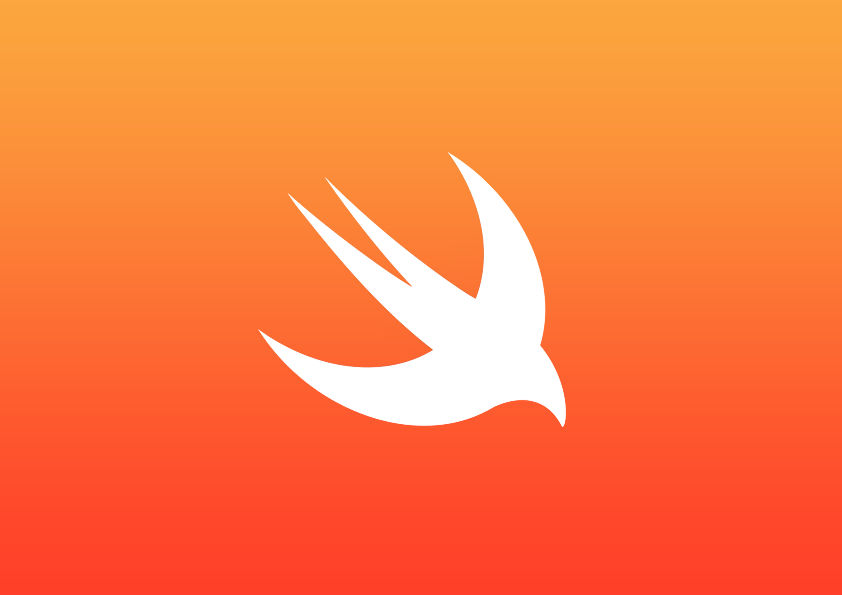

---

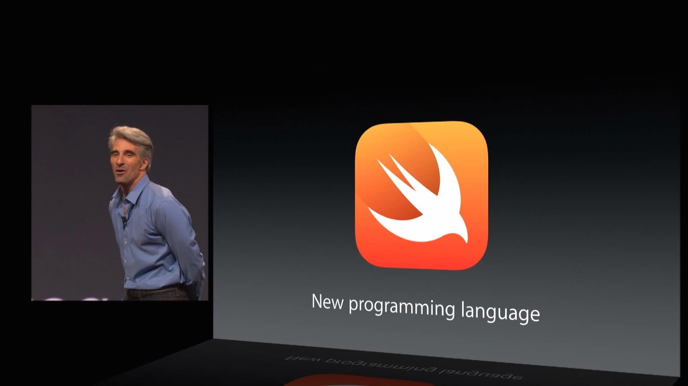

^ Juni 2014

---

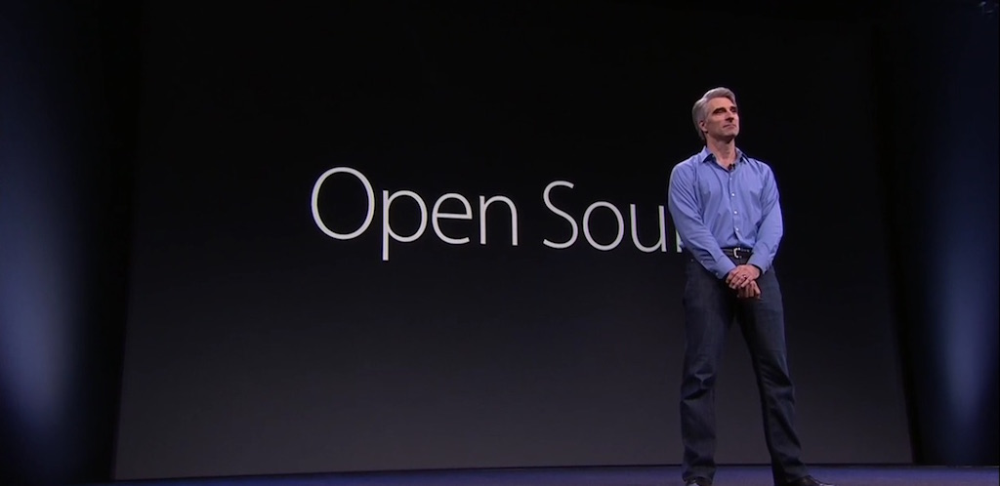

^ Juni 2015

---


#🙄

---

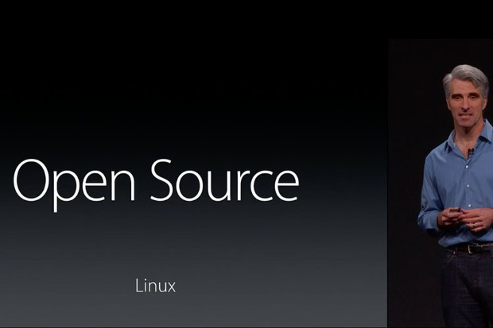

---


#😳

---

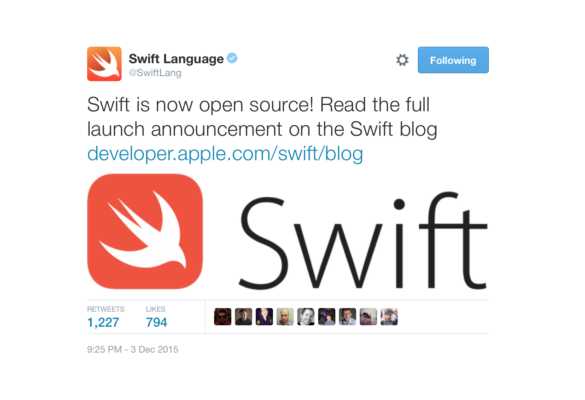

---

##[swift.org](https://swift.org)

---

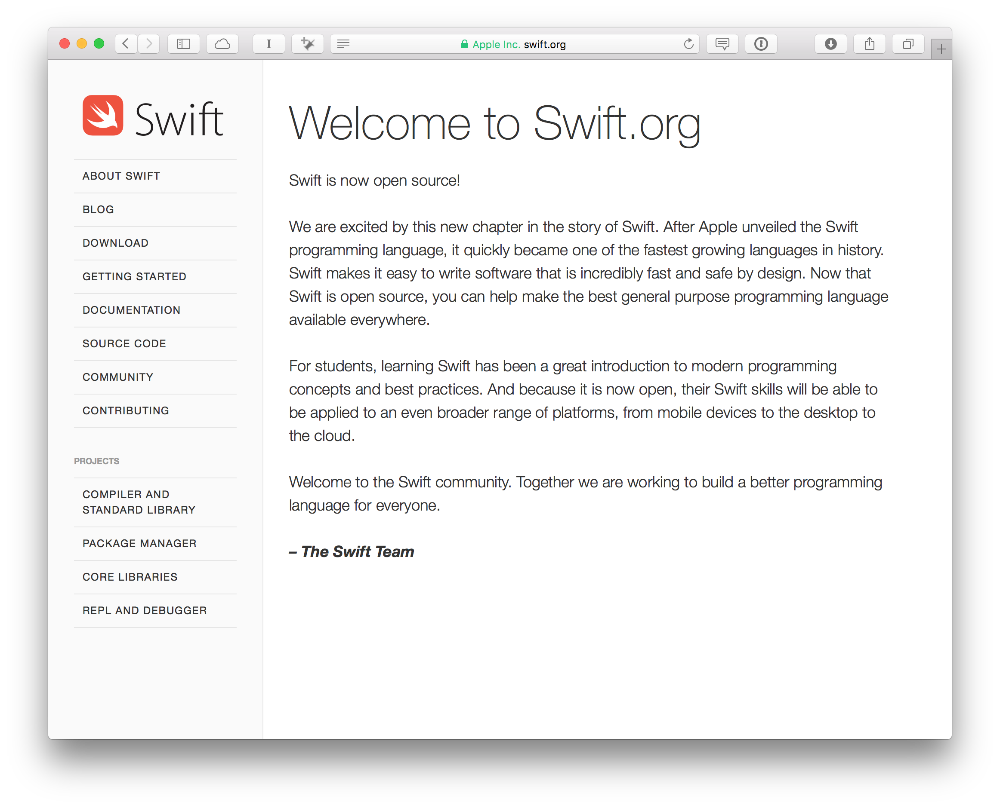

---

- bug reporting system (JIRA)
- Mailing lists
- engineering blog
- community guidelines
- tutorials
- contributing instructions
- socumentation on Swift
- developer and API design guidelines


---

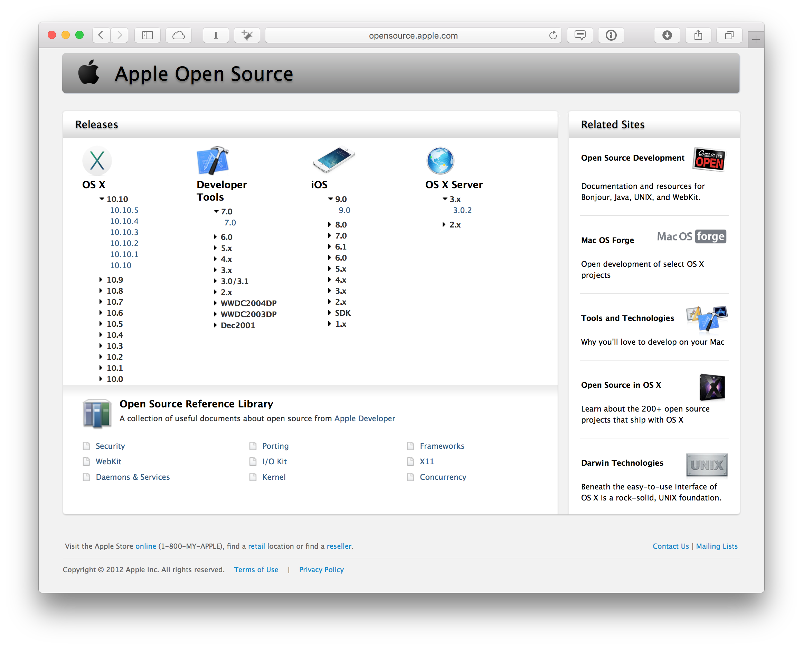

^ Was Apple auch hätte machen können...

---

### So Open Source wie nur möglich!

---

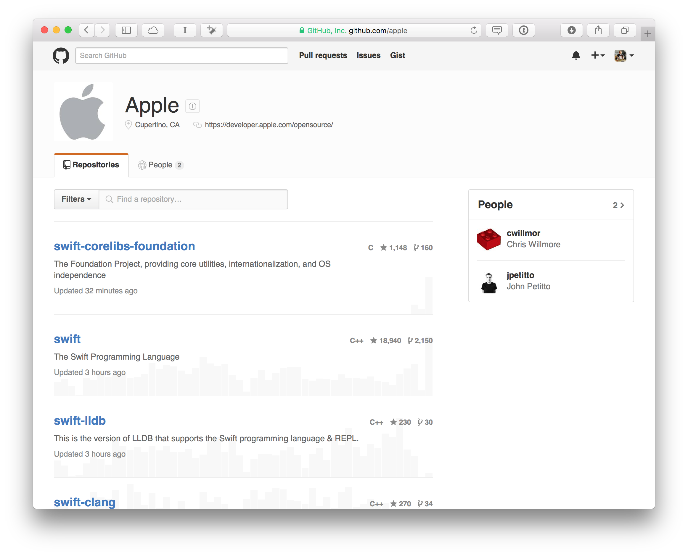

---

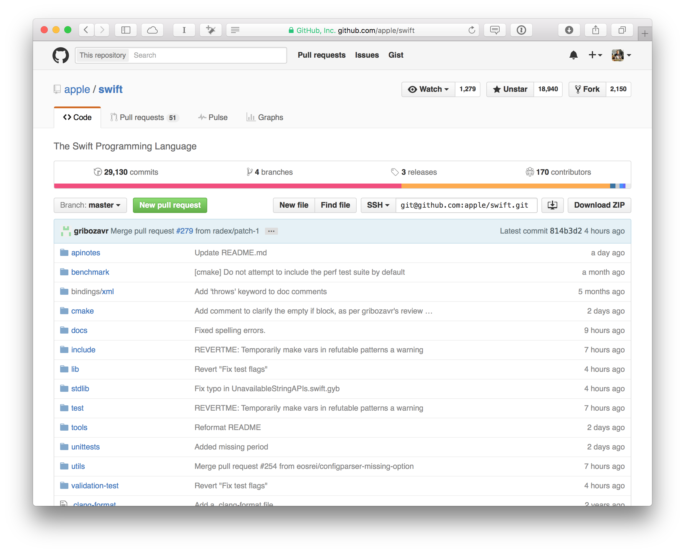

^ Inklusive der kompletten Commithistory! Wenn auch leicht nachbearbeitet 😜
<!-- https://vimeo.com/147777653 -->

---

## Apache 2.0 License

^ Frei verwendbar, modifizierbar und verteilbar
^ Bleibt bei Veränderungen unter der Lizenz
^ Änderungen müssen nicht zurückgeschickt werden
^ Software, die darauf aufbaut, muss nicht Apache 2.0 lizenziert sein

---

## [bugs.swift.org](https://bugs.swift.org)

---

### PRs werden bereits akzeptiert 🎉✨

^ Jetzt liegt es daran, was die Community daraus macht :) 99% aktuell Typo-Fixes.. :D

---

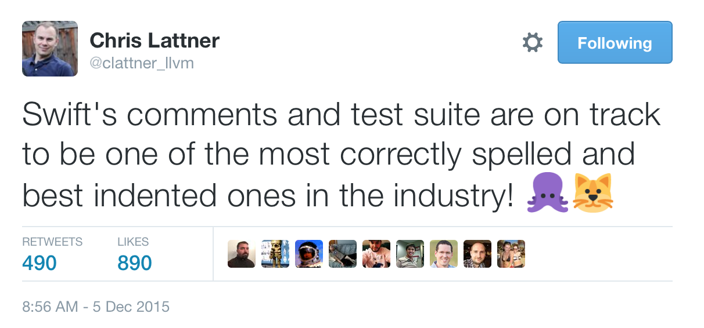

---

## Stdlib?

---

### [SwiftDoc.org](http://swiftdoc.org)

---

## Foundation!

---

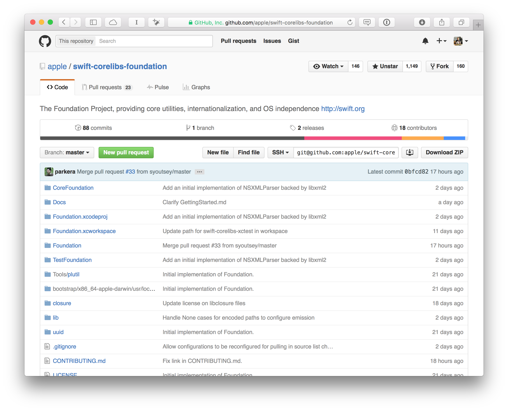

---

> We will also drop the 'NS' prefix from all Foundation classes.
-- https://github.com/apple/swift-corelibs-foundation

---

NSObject, NSEnumerator, NSSwiftRuntime, NSObjCRuntime, NSURL, NSURLSession, NSFormatter, NSDateFormatter, NSPropertyList, NSCoder, NSKeyedArchiver, NSJSONSerialization, NSOrderedSet, NSIndexSet, NSIndexPath, NSArray, NSDictionary, NSSet, NSCache, NSSortDescriptor, NSPort, NSPortMessage, NSRunLoop, NSStream, NSTimer, NSRegularExpression, NSScanner, NSTextCheckingResult, NSAttributedString, NSCharacterSet, NSString, NSCFString, NSRange, NSDecimal, NSDecimalNumber, NSGeometry, NSAffineTransform, ...

---

... NSNumber, NSValue, NSUserDefaults, NSLocale, NSFileHandle, NSFileManager, NSTask, NSBundle, NSProcessInfo, NSThread, NSOperation, NSLock, NSPathUtilities, NSCalendar, NSDate, NSTimeZone, NSNotification, NSNotificationQueue, NSNull, NSData, NSProgress, NSError, NSUUID, NSPersonNameComponents, FoundationErrors

Status: [Link](https://github.com/apple/swift-corelibs-foundation/blob/master/Docs/Status.md)

---

## Swift Evolution

---

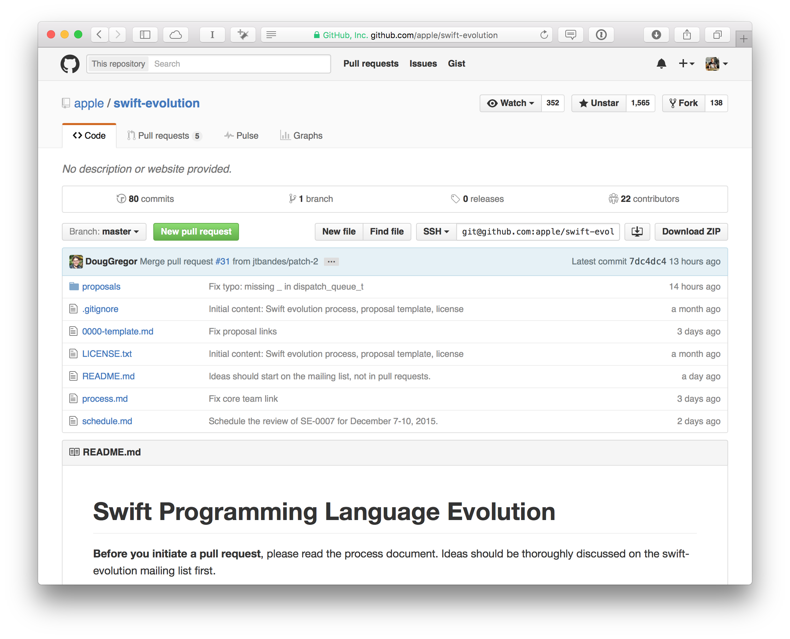

---

###[swift-evolution@swift.org](https://lists.swift.org/mailman/listinfo/swift-evolution)


---

- Remove the `++` and `--` operators
- Removing `var` from Function Parameters and Pattern Matching
- (Remove C-style for-loops with conditions and incrementers)

---

## Swift Package Manager

---

### @mxcl & @mattt

^ Max Howell -> Homebrew
^ Mattt Thompson -> NSHipster / AFNetworking, Alamofire

---

### Package.swift

^ ähnlich der Podfile, Cartfile, package.json, Gemfile

---

### apple/example-package-dealer

```swift
import PackageDescription

let package = Package(
    name: "Dealer",
    dependencies: [
        .Package(url: "https://github[...].git", majorVersion: 1),
    ]
)
```

---

### `> swift build`
### `> .build/debug/Dealer`

---

### SPM & Cocoapods & Carthage?

---

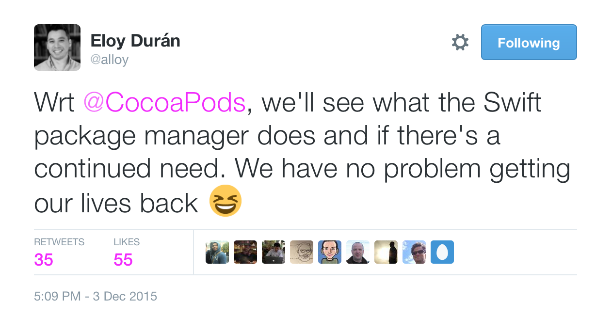

---

# Erste *Linux-ready* Projekte

- [kylef/Curassow](https://github.com/kylef/Curassow) - HTTP Server
- [sharplet/Regex](https://github.com/sharplet/Regex) - Regex µframework
- [Anviking/Decodable](https://github.com/Anviking/Decodable) - JSON framework
- [SwiftyJSON](https://github.com/SwiftyJSON/SwiftyJSON) - JSON framework
- [kylef/Commander](https://github.com/kylef/Commander) - CLI framework
- [kylef/Stencil](https://github.com/kylef/Stencil) - templating framework

---

#[IBM Swift Sandbox](http://swiftlang.ng.bluemix.net/#/repl)

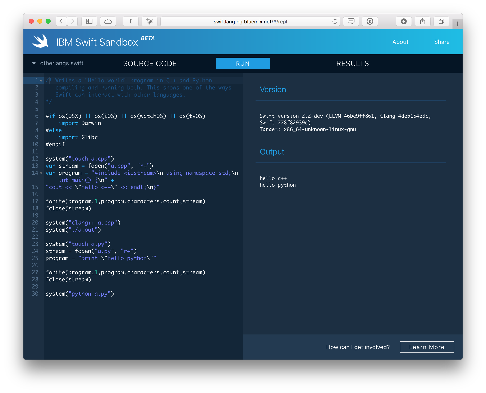

---

TODO: Hier noch eigenes Codebeispiel einbauen?

---

# Weitere Links

- [Diskussion auf HN](https://news.ycombinator.com/item?id=10669891)
- [Craig Federighi Ars Technica Interview](http://arstechnica.com/apple/2015/12/craig-federighi-talks-open-source-swift-and-whats-coming-in-version-3-0/)
- [SPM Community Proposal](https://github.com/apple/swift-package-manager/blob/master/Documentation/PackageManagerCommunityProposal.md)

---

# API Design Guidelines

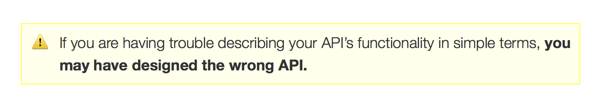

:grin:

<!--
TODO:
 - Überall ein paar Rednernotizen wenn ich schon auf so minimalistische Folien stehe?
 - Eigenes Beispiel mit SPM bauen und wenn richtig awesome isses ein server der auf dokku deployed wird \o/

-->

<!--
Weitere Links:
 - https://realm.io/news/swift-opensource/
 -->
