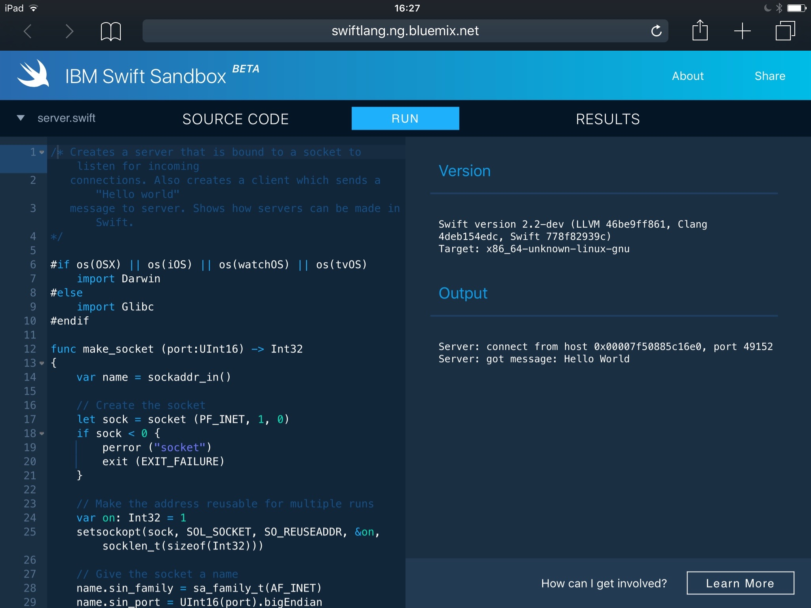

slidenumbers: true

# Open Source Swift 🎉


---


^ Juni 2014

---


^ Juni 2015

---


#🙄

^ Toll, aber naja... ObjC ist auch "open source", ist zwar nett, bringt aber nicht viel.

---


---


#😳

^ Oha! Und auch noch von Apple selbst? Nicht schlecht!

^ Einzige Abhängigkeit ist clang und llvm

---


^ It happened! 😳

---

##[swift.org](https://swift.org)

^ swift-lang.org war ja leider schon weg 😜

---


^ So schaut's aus

---

- bug reporting system (JIRA)
- mailing lists
- engineering blog
- community guidelines
- tutorials
- contributing instructions
- documentation on Swift
- developer and API design guidelines


---


^ Was Apple auch hätte machen können...

---

### So Open Source wie nur möglich!

^ Aber sie gehen hier einen anderen Weg

---


^ Erstens ist alles auf GitHub!

---


^ Inklusive der kompletten Commithistory! Wenn auch leicht nachbearbeitet 😜

---


---


---

## Apache 2.0 License

^ Frei verwendbar, modifizierbar und verteilbar

^ Bleibt bei Veränderungen unter der Lizenz

^ Änderungen müssen nicht zurückgeschickt werden

^ Software, die darauf aufbaut, muss nicht Apache 2.0 lizenziert sein

---

## Swift-Compiler

- Parser/Lexer -> baut Abstract Syntax Tree (AST)
- Semantische Analyse -> Typinformationen
- Clang importer -> C und C++ APIs in Swift-APIs
- SIL -> Analyse & Optimierung von Swift-Code
- LLVM -> generiert Maschinencode

^ SIL = Swift Intermediate Language

---

## https://github.com/apple/swift

- 59.9 % C++
- 36.5 % Swift
-  0.9 % Python
-  0.6 % Objective-C
-  0.6 % Objective-C++

---

## https://github.com/apple/swift

- 517 geschlossene PRs
- 78 offene PRs
- > 30.000 Commits
- 227 Contributers

---

## https://github.com/apple/swift

- Compiler
- Swift Standardlib
- update- & install-scripts
	- auch für Foundation und XCTest
- REPL
- lldb

^ Um Foundation oder XCTest auf Linux zu installieren, muss Swift komplett von Scratch geladen und gebaut werden (mit install flags)

---


### PRs werden bereits akzeptiert 🎉✨

^ Jetzt liegt es daran, was die Community daraus macht 😊 99% aktuell Typo-Fixes.. 😄
Aber hey, alles was Dinge verbessert, ist eine wertvolle contribution 😊

^ @jtbandes hat mehr als 400 crashes per PR gefixt (#253, #272)

---


---

## [bugs.swift.org](https://bugs.swift.org)

^ Ein öffentlicher Issuetracker! Ein JIRA ist's.

^ bugreporter.apple.com oder hier?

---

## bugs.swift.org:

- 174 To Done
- 8 In Progress
- 52 Done

---

## Stdlib?

^ Stdlib war von Apple versprochen. Aber was heißt das?
Swift ist nichts ohne Stdlib... String, Int, Array, Dictionary, etc.

^ swiftdoc.org von @mattt

---

## Foundation!

^ Aber Apple portet Foundation! Komplett in Swift ohne ObjC!

---


^ Auch das ist alles auf GitHub!

^ Etliches davon wirft noch NSUnimplented(), aber auch hier kann man contributen 😊

---

> We will also drop the 'NS' prefix from all Foundation classes.
-- https://github.com/apple/swift-corelibs-foundation

---

NSObject, NSEnumerator, NSSwiftRuntime, NSObjCRuntime, NSURL, NSURLSession, NSFormatter, NSDateFormatter, NSPropertyList, NSCoder, NSKeyedArchiver, NSJSONSerialization, NSOrderedSet, NSIndexSet, NSIndexPath, NSArray, NSDictionary, NSSet, NSCache, NSSortDescriptor, NSPort, NSPortMessage, NSRunLoop, NSStream, NSTimer, NSRegularExpression, NSScanner, NSTextCheckingResult, NSAttributedString, NSCharacterSet, NSString, NSCFString, NSRange, NSDecimal, NSDecimalNumber, NSGeometry, NSAffineTransform, ...

^ Endlich nicht mehr das hier

---

... NSNumber, NSValue, NSUserDefaults, NSLocale, NSFileHandle, NSFileManager, NSTask, NSBundle, NSProcessInfo, NSThread, NSOperation, NSLock, NSPathUtilities, NSCalendar, NSDate, NSTimeZone, NSNotification, NSNotificationQueue, NSNull, NSData, NSProgress, NSError, NSUUID, NSPersonNameComponents, FoundationErrors

Status: [Link](https://github.com/apple/swift-corelibs-foundation/blob/master/Docs/Status.md)

^ Und es geht noch weiter 😄

---

## libdispatch!

^ Grand Central Dispatch -> aktuell nur auf Darwin Plattformen (OS X) -> Dieses Projekt zielt ab, dass gcd auf allen Swift kompatiblen Plattformen in einer 'modernen' Version läuft.

---

## XCTest!

---

## XCTest

- Framework für Unit-Tests von Swift-Packages und -Apps
- selbst in Swift geschrieben
- soll ebenfalls auf allen Swift-kompatiblen Plattformen laufen

^ Brian Gesiak (@modocache) hat angemerkt, dass die Tests nicht getestet sind.

^ Klassen sollen gleich bleiben wie bei dem bestehenden Framework, so dass Tests nicht neu geschrieben werden müssen.

---

## Swift Evolution

^ Noch was: Swift Evolution oder wie geht's weiter mit der Sprache

---


^ Auch ein GitHub Repo mit Proposals

^ Einfach mal reinschauen, markdown mit sauberen Beschreibungen und gut dokumentierten Anliegen

---

###[swift-evolution@swift.org](https://lists.swift.org/mailman/listinfo/swift-evolution)


^ Diskussion über die Mailingliste,
hier nicht direkt PRs
Alternativ: low volume announcement mailing list

^ Weitere Swift Entwicklung bleibt auch offen! Keine Keynote Überraschungen.

---

- Remove the `++` and `--` operators
- Removing `var` from Function Parameters and Pattern Matching
- Remove C-style for-loops with conditions and incrementers

^ Drei ausgewählte bereits angenommene Proposals, #3 von Erica Sadun

---

## SE-0005: Better Translation of Objective-C APIs Into Swift

```swift
let contentString = listItemView.stringValue.stringByTrimmingCharactersInSet(
   NSCharacterSet.whitespaceAndNewlineCharacterSet())
```

--

```swift
let content = listItem.stringValue.trimming(.whitespaceAndNewlines)
```

---

## Swift Package Manager

^ Auch sehr unerwartet!

^ convention based

^ source-based distribution, nicht precompiled binaries

^ decentralization

---

### @mxcl & @mattt

^ Max Howell -> Homebrew

^ Mattt Thompson -> NSHipster / AFNetworking, Alamofire

---

### Package.swift

^ manifest file ähnlich der Podfile, Cartfile, package.json, Gemfile

^ swift code; soll besser maschinenlesbar werden

---

## apple/example-package-dealer

```swift
import PackageDescription

let package = Package(
    name: "Dealer",
    dependencies: [
        .Package(url: "https://github[...].git", majorVersion: 1),
    ]
)
```

^ die Version läuft über git tags

^ semver!

^ Neue Features seit Release: Exclude folders, viele Bugfixes, detailierte Ausgabe, Fehlerhandling

---

### `> swift build`
### `> .build/debug/Dealer`

---

## Sources

- kein Verzeichnis
- `Sources` Verzeichnis
- andere Unterverzeichnisse

^ Mehrere Möglichkeiten für die Source Dateien

---

## kein Verzeichnis

```
project/Package.swift
project/main.swift
project/foobar.swift
```

`swift build` baut ein `project` Modul

---

## *Sources* Verzeichnis

```
project/Package.swift
project/Sources/main.swift
project/Sources/foobar.swift
```

`swift build` baut ein `project` Modul

`Sources` kann auch `Source`, `srcs` oder `src` heißen

^ Mehrere Sources Verzeichnisse sind nicht erlaubt

^ Unterverzeichnisse in Sources sind möglich, werden als einzelne Module gebaut

---

## einzelne Unterverzeichnisse

```
project/Package.swift
project/mod1/main.swift
project/mod2/foo.swift
```

`swift build` baut zwei Module, `mod1` und `mod2`

---

## main.swift

Falls vorhanden baut SPM ein ausführbares Modul, andernfalls eine Library.

---

## Weitere Pläne

- Package Index
- Enforced Semantic Versioning
- Standardisiertes Licensing
- Support für andere Sprachen, Build Systeme
- andere Versionierungssysteme

^ Versioning mit API analysis, ähnlich für licenses

^ Nachzulesen im SPM Community Proposal

---

### SPM & Cocoapods & Carthage?

---


---

## Swift.org Team

- Project Lead - Chris Lattner (clattner@apple.com)
- Core Team
	- Chris Lattner (clattner@apple.com)
	- Doug Gregor (dgregor@apple.com)
	- Ted Kremenek (kremenek@apple.com)
	- Joe Pamer (jpamer@apple.com)
	- John McCall (rjmccall@apple.com)
	- Joe Groff (jgroff@apple.com)
	- Dave Abrahams (dabrahams@apple.com)

---

# Erste *Linux-ready* Projekte

- [kylef/Curassow](https://github.com/kylef/Curassow) - HTTP Server
- [sharplet/Regex](https://github.com/sharplet/Regex) - Regex µframework
- [Anviking/Decodable](https://github.com/Anviking/Decodable) - JSON framework
- [SwiftyJSON](https://github.com/SwiftyJSON/SwiftyJSON) - JSON framework
- [kylef/Commander](https://github.com/kylef/Commander) - CLI framework
- [kylef/Stencil](https://github.com/kylef/Stencil) - templating framework

---

#[IBM Swift Sandbox](http://swiftlang.ng.bluemix.net/#/repl)



^ Ähnliches gab's vorher schon, aber hier läuft Swift 2.2.
Siehe swiftstub.com, runswiftlang.com

^ Alle coolen Sprachen haben sowas 😀 siehe play.golang.org

---

```Swift
#if os(Linux)
    import Glibc
#else
    import Darwin.C
#endif
import HTTP
import Epoch
import CHTTPParser
import CLibvenice

struct ServerResponder: ResponderType {
    func respond(request: Request) -> Response {
		let path = request.uri.path
		let text = path?.splitBy("/").last ?? ""
        return Response(status: .OK, body: "text")
    }
}

let responder = ServerResponder()
let server = Server(port: 8080, responder: responder)
server.start()
```

---

# Weitere Links

- [Diskussion auf HN](https://news.ycombinator.com/item?id=10669891)
- [Craig Federighi Ars Technica Interview](http://arstechnica.com/apple/2015/12/craig-federighi-talks-open-source-swift-and-whats-coming-in-version-3-0/)
- [SPM Community Proposal](https://github.com/apple/swift-package-manager/blob/master/Documentation/PackageManagerCommunityProposal.md)

^ Zum Nachlesen über die Links der PDF

---

#### github/practicalswift/swift-compiler-crashes

^ Kennt wer?

^ Schon seit 2014 im apple/swift repo

---


( BY 4.0) - [ePub](https://swift.org/documentation/TheSwiftProgrammingLanguage\(Swift2.2\).epub)

---

# API Design Guidelines


#:grin:

^ swift.org liest sich super, hier ein "Schmankerl" 😄

<!--
TODO:
 - Eigenes Beispiel mit SPM bauen und wenn richtig awesome isses ein server der auf dokku deployed wird \o/

-->

<!--
Weitere Links:
 - https://realm.io/news/swift-opensource/
 -->
